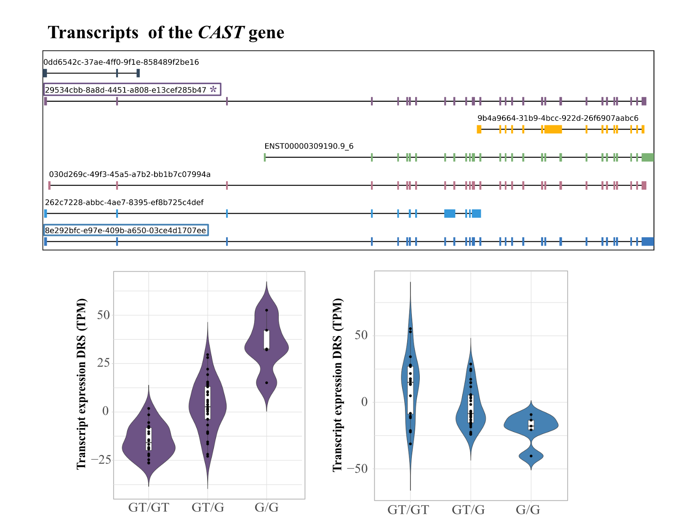

[README.md](https://github.com/user-attachments/files/25267606/README_general_Github.md)
# Direct long-read RNA sequencing uncovers functional variation affecting transcript production and RNA modifications.

[](https://doi.org/10.5281/zenodo.12555794)
[](LICENSE)
[](https://www.linux.org/)

> This repository provides the complete analysis pipeline for characterizing
  genetic regulation of gene expression and RNA processing at multiple
  molecular levels in 60 lymphoblastoid cell lines sequenced with Oxford
  Nanopore Direct RNA sequencing (DRS).


### Overview

**Transcript-Level Analysis:**
- **Full-length isoform quantification** using FLAIR (primary method)
- **Isoform structural validation** with SQANTI3
- **Alternative methods** for comparison: Bambu and StringTie
- **Transcript dominance assessment** to identify major isoforms per gene

**Gene Expression Analysis:**
- Gene-level quantification from long-read RNA-seq
- Comparison with short-read RNA-seq for validation

**Multi-Level QTL Discovery:**
- **Expression QTLs (eQTLs)** - Genetic variants affecting gene expression 
- **Transcript QTLs (tQTLs)** - Genetic variants affecting isoform abundance
- **m⁶A modification QTLs (m⁶AQTLs)** - Genetic variants affecting RNA modification ratio

### Dataset

- **Sample size:** 60 lymphoblastoid cell lines (LCLs)
- **RNA sequencing:** Oxford Nanopore Direct RNA-seq (native RNA, no amplification, DRS)
- **Genotypes:** Whole genome sequencing (30x coverage)
- **Annotation:** Gencode v46 (hg19/GRCh37)

### Workflow Stages

1. **Gene Expression Quantification** - Alignment (minimap2), counting (featureCounts), normalization (RPKM)
2. **Transcript Isoform Discovery** - Full-length isoform detection (FLAIR), validation (SQANTI3), quantification
3. **QTL Mapping** - Multi-level genetic association testing with systematic covariate optimization
4. **m⁶A Modification Analysis** - Detection of RNA modifications and associated genetic variants
5. **Replication** - Testing discoveries in independent short-read cohorts

---

## Highlights

**Why This Pipeline?**

- **Long-read advantage:** Sequences full-length transcripts, capturing complete isoform structures
- **Multi-level integration:** Connects genetic variants to expression, transcript isoforms, and RNA modifications
- **Rigorous validation:** Multiple quantification methods, SQANTI3 validation, replication cohorts
- **Production-ready:** Optimized parameters, comprehensive documentation, publication-quality outputs
- **Reproducible:** Complete environment specifications, version-controlled code

---
## Analysis Workflow

### Stage 1: Gene Expression Quantification

```
Raw FASTQ files
      ↓
[Align to genome] ────────────── minimap2
      ↓
[Count per gene] ────────────── featureCounts  
      ↓
[Normalize to RPKM] ──────────── edgeR
      ↓
[Filter: 50% threshold]
      
```

### Stage 2: Transcript Isoform Quantification

```
Aligned BAM files
      ↓
[Correct splice sites] ────────── FLAIR correct
      ↓
[Collapse to isoforms] ────────── FLAIR collapse
      ↓
[Quantify expression] ─────────── FLAIR quantify
      ↓
[Validate structure] ──────────── SQANTI3
      ↓
[Reannotate novel isoforms]
      ↓
[Filter: protein-coding/lincRNA + 50%]
     
```

### Stage 3: QTL Discovery

```
Expression data + Genotypes
      ↓
[Calculate expression PCs]
      ↓
[Test PC levels: 0, 3, 6, ..., 60] ──── Optimize covariates
      ↓
      ├─────────────────┬─────────────────┐
      ↓                 ↓                 ↓
[eQTL Permutation] [tQTL Permutation] [m⁶AQTL Permutation]
   1000 perms         1000 perms         1000 perms
      ↓                 ↓                 ↓
[Calculate FDR]    [Calculate FDR]    [Calculate FDR]
      ↓                 ↓                 ↓
[Nominal pass]     [Nominal pass]     [Nominal pass]
  All variants       All variants       All variants

```
### Stage 4: m6A RNA modification and m6aQTL discovery

```
Raw FASTQ + Fast5 files
      ↓
[Align to transcriptome] ──────── minimap2
      ↓
[Signal-level event alignment] ── f5c eventalign
      ↓
[m⁶A site inference] ──────────── m6anet (1000 iterations)
      ↓
[Merge per-sample outputs] ──────── Python (modification ratio matrix)
      ↓
[Filter: prob >0.9, ≥50% samples, protein-coding/lncRNA]
      ↓
[Map transcript → genomic coordinates]
      ↓
[m⁶AQTL permutation pass] ─────── QTLtools cis --grp-best
      ↓
[FDR calibration + PC selection]
      ↓
[Nominal pass] ─────────────────── all cis SNP–modification pairs
      ↓
[Replication] ──────────────────── short-read eQTL / sQTL + Yoruba m⁶A-seq   
```

### Stage 5: Replication

```
Discovery Results
      ↓
[Test in short-read cohort]
      ↓
[Assess replication rate]
```

---

## Quick Start

### Prerequisites

```bash
# Required software
minimap2 (v2.17+)
samtools (v1.10+)
htslib (v1.23)
featureCounts (subread v2.0+)
FLAIR (v3.0.0)
SQANTI3 (v3.0+)
QTLtools (v1.3+)
f5c (v1.2+)
m6anet (v2.1.0+)
R (v4.0+) with packages: edgeR, data.table, qvalue, ggplot2, GenomicRanges, UpSetR
```
### Installation

```bash
# Clone repository
git clone https://github.com/yourusername/DRS-LCLs-qtl-analysis.git
cd DRS-LCLs-qtl-analysis

# Create conda environment
conda env create -f environment/environment.yml
conda activate drs-qtl
```
### R Packages

```r
# Bioconductor
BiocManager::install(c("edgeR", "rtracklayer", "GenomicRanges", "bambu"))

# CRAN
install.packages(c("data.table", "ggplot2", "dplyr", "tidyr", 
                   "qvalue", "gplots", "corrplot"))
```
### Python Packages

```bash
pip install nanopolish m6anet pandas numpy scipy matplotlib
```
### Run Complete Pipeline

```bash
# Stage 1: Gene expression
cd scripts/01_gene_expression_quantification
bash 01_longread_alignment_quantification.sh
bash 02_gene_expression_filtering.sh

# Stage 2: Transcript isoforms
cd ../02_transcript_quantification
bash 01_flair_transcript_quantification.sh
Rscript 02_flair_complete_analysis_with_sqanti.R

# Stage 3: QTL mapping
cd ../03_qtl_mapping
bash 01_eqtl_permutation.sh    # Gene-level QTLs
bash 03_trqtl_permutation.sh    # Transcript-level QTLs

# Stage 4: m⁶A modifications and m⁶AQTLs
cd ../04_m6a_modification_analysis
bash 00_ont_m6a_detection_pipeline.sh              # align, eventalign, m6anet inference
bash 00_ont_m6a_detection_pipeline.sh --merge-only # merge per-sample outputs
Rscript 01_m6a_filter_and_coords.R                # filter + genomic coordinate mapping
Rscript 02_maQTL_mapping_pipeline.R               # BED prep + PCA + permutation pass
Rscript 02_maQTL_mapping_pipeline.R --merge-perm
Rscript 02_maQTL_mapping_pipeline.R --fdr         # PC selection + FDR
Rscript 02_maQTL_mapping_pipeline.R --nominal
Rscript 02_maQTL_mapping_pipeline.R --merge-nominal
Rscript 03_maQTL_replication_QTL.R                # eQTL + sQTL replication
Rscript 04_maQTL_yoruba_replication.R             # Yoruba m⁶A-seq validation
```

---

## Repository Structure

```
scripts/
│
├── 01_gene_expression_quantification/
│   ├── 01_longread_alignment_quantification.sh
│   ├── 02_gene_expression_filtering.sh
│   ├── 03_longread_vs_shortread_comparison.R
│   └── README.md
│
├── 02_transcript_quantification/             
│   ├── 01_flair_transcript_quantification.sh    ← Major component
│   ├── 02_flair_complete_analysis_with_sqanti.R
│   ├── 03_transcript_dominance_assessment.R
│   ├── 04_bambu_transcript_quantification.R       (Alternative)
│   ├── 05_stringtie_transcript_quantification.sh  (Alternative)
│   └── README.md                               
│
├── 03_qtl_mapping/
│   ├── 01_eqtl_permutation.sh
│   ├── 02_eqtl_nominal.sh
│   ├── 03_trqtl_permutation.sh
│   ├── 04_trqtl_nominal.sh
│   ├── 05_qtl_plot_examples.R
│   └── README.md
│
├── 04_m6a_modification_analysis/
│   ├── 00_ont_m6a_detection_pipeline.sh       ← ONT alignment → m6anet inference → merge
│   ├── 01_m6a_filter_and_coords.R             ← filter + transcript→genome mapping
│   ├── 02_maQTL_mapping_pipeline.R            ← BED prep → PCA → QTL mapping
│   ├── 03_maQTL_replication_QTL.R             ← eQTL / sQTL replication
│   ├── 04_maQTL_yoruba_replication.R          ← Yoruba m⁶A-seq orthogonal validation
│   ├── 05_maQTL_visualization.R               ← figures and plots
│   └── README.md
│
└── 05_replication_analysis/
    ├── 01_shortread_replication.sh
    ├── 02_compare_qtl_discoveries.R
    └── README.md
```
---

## Methods

### Gene Expression Quantification

**Alignment:**
- Tool: minimap2
- Mode: splice-aware (`-ax splice`)
- Strand: forward only (`-uf`)

**Quantification:**
- Tool: featureCounts
- Features: protein-coding and lincRNA genes
- Method: fractional counting for multi-mappers
- Normalization: RPKM

### Transcript Isoform Quantification

**Discovery:**
- Primary method: FLAIR (Full-Length Alternative Isoform analysis of RNA)
- Steps: correct → collapse → quantify
- Minimum support: 10 reads per isoform

**Validation:**
- Tool: SQANTI3
- Purpose: structural classification of novel isoforms
- Categories: FSM, ISM, NIC, NNC

### QTL Mapping

**Tool:** QTLtools v1.3

**Approach:**
- Mode: permutation (1000 permutations)
- Window: ±1 Mb from TSS (cis-acting)
- Covariates: expression PCs (optimized)
- FDR control: Benjamini-Hochberg at 5%

**Optimization:**
- Test PC levels: 0, 3, 6, 9, ..., 60
- Select based on: discovery plateau + π₁ statistic
- Typical optimal: 3-15 PCs for gene eQTL, 0-6 for transcript tQTL

**Output:**
- Permutation pass: best SNP per gene/transcript
- Nominal pass: all tested SNP-gene pairs

### m⁶A Modification Detection and m⁶AQTL Mapping

**Detection:**
- Tool: m6anet v2.1.0 (trained on SQK-RNA002 chemistry)
- Signal alignment: f5c eventalign
- Inference: 1000 sampling rounds per site; sites retained at probability >0.9
- Phenotype: per-sample modification ratio (fraction of modified reads)

**Filtering:**
- Sites with >50% missing values removed
- Restricted to protein-coding genes and lncRNAs (GENCODE v46)
- Transcript-relative positions mapped to genomic coordinates using exon-aware cumulative length conversion

**QTL Mapping:**
- Same QTLtools framework as eQTL/tQTL (see above)
- `--grp-best` flag groups multiple modification sites per transcript
- Selected covariates: sex, 3 genotype PCs, 3 modification PCs
- FDR < 10%

**Replication:**
- Short-read: eQTL and sQTL overlap via nominal p-value matching + q-value FDR
- Orthogonal: overlap with Yoruba LCL m⁶A-seq peaks (1000 Genomes Project)
  
---

## Documentation

Each analysis folder contains detailed documentation:

- **[Gene Expression Quantification](scripts/01_gene_expression_quantification/README_gene_expression_final.md)** - Alignment, counting, normalization, filtering
- **[Transcript Quantification](scripts/02_transcript_quantification/README_transcript_quantification.md)** - FLAIR workflow, SQANTI3 validation, alternative methods comparison, dominance assessment
- **[QTL Mapping](scripts/03_qtl_mapping/README_qtl_mapping.md)** - PC optimization, permutation testing, nominal pass
- **[m⁶A Analysis](scripts/04_m6a_modifications/README.md)** - ONT signal-level modification detection (m6anet), filtering, genomic coordinate mapping, m⁶AQTL permutation and nominal passes, replication in short-read eQTL/sQTL and Yoruba m⁶A-seq datasets
- **[Replication](scripts/05_shortread_recapitulation_DRS/README.md)** - Short-read validation, technology comparison
- 
### Key Concepts Explained

**Transcript Dominance:**
- Identifies the major expressed isoform per gene
- Important for understanding which isoform is functionally relevant
- Used to prioritize tQTL candidates

**trQTL vs eQTL:**
- **eQTL:** Changes total gene expression (sum of all isoforms)
- **trQTL:** Changes relative isoform usage (ratio between isoforms)
- tQTLs can exist without affecting total expression
- Uses `--grp-best` flag to group transcripts by gene

**SQANTI Classification:**
- **FSM** (Full Splice Match): Exact match to reference
- **ISM** (Incomplete Splice Match): Subset of reference junctions
- **NIC** (Novel In Catalog): New combination of known junctions
- **NNC** (Novel Not in Catalog): Contains novel junctions

---

## Methods Summary

### Transcript Quantification Workflow

**Step 1: FLAIR Correction**
```bash
# Corrects splice sites using reference annotation
python flair.py correct -q aligned.bed -g genome.fa -f annotation.gtf
```

**Step 2: FLAIR Collapse**
```bash
# Collapses reads into unique isoforms
python flair.py collapse -g genome.fa -r reads.fq -q corrected.bed
```

**Step 3: FLAIR Quantification**
```bash
# Quantifies isoform expression across samples
python flair.py quantify -r reads_manifest.tsv -i isoforms.fa
```

**Step 4: SQANTI3 Validation**
```bash
# Validates isoform structures
python sqanti3_qc.py isoforms.gtf annotation.gtf genome.fa
```

**Step 5: Filtering & Reannotation**
- Filter for protein-coding and lincRNA genes
- Apply 50% expression threshold
- Reannotate novel isoforms
- Assess transcript dominance

### QTL Mapping Approach

**PC Optimization:**
- Test 0, 3, 6, ..., 60 expression PCs as covariates
- Select optimal based on discovery plateau + π₁ statistic
- Typically: 3-15 PCs for eQTL, 0-6 PCs for tQTL

**Permutation Testing:**
- 1,000 permutations per gene/transcript
- FDR control at 5%
- Identifies best SNP per gene/transcript

**Nominal Pass:**
- Tests all SNP-gene pairs in cis-window (±1 Mb)
- Required for colocalization, fine-mapping, Mendelian randomization
- Output: 500 MB - 1 GB compressed

---
## Data availability
- Zenodo (10.5281/zenodo.18763244): BAM files and quantifications derived, as well as m⁶A modification information.
- Data was deposited in ENA, under the following accession number PRJEB76585. This includes raw fast5 files.

---
## Citation

If you use this pipeline in your research, please cite:

Réal A. et al. (2024). Long-read RNA sequencing reveals transcript-level genetic regulation in lymphoblastoid cell lines. Research Square. (https://doi.org/10.21203/rs.3.rs-4613444/v1)

### Key Software Citations

**Transcript Quantification:**
- **FLAIR:** Tang, A.D. et al. (2020). Full-length transcript characterization of SF3B1 mutation in chronic lymphocytic leukemia. *Nature Communications*, 11(1), 1438.
- **SQANTI3:** Tardaguila, M. et al. (2018). SQANTI: extensive characterization of long-read transcript sequences. *Genome Research*, 28(7), 1096-1108.
- **Bambu:** Chen, Y. et al. (2023). Context-aware transcript quantification from long-read RNA-seq. *Genome Biology*, 24(1), 83.

**Alignment & QTL Mapping:**
- minimap2: Li, H. (2018). Minimap2: pairwise alignment for nucleotide sequences. *Bioinformatics*, 34(18), 3094-3100.
- QTLtools: Delaneau, O. et al. (2017). A complete tool set for molecular QTL discovery and analysis. *Nature Communications*, 8, 15452.

**m⁶A Detection:**
- m6anet: Hendra, C. et al. (2022). Detection of m6A from direct RNA sequencing using a multiple instance learning framework. *Nature Methods*, 19(12), 1590-1598.
- f5c: Gamaarachchi, H. et al. (2020). GPU accelerated adaptive banded event alignment for efficient nanopore basecalling. *BMC Bioinformatics*, 21(1), 343.

---

## Contributing

Contributions are welcome! Please:

1. Fork the repository
2. Create a feature branch
3. Commit your changes
4. Submit a pull request

For bug reports or questions, please [open an issue](https://github.com/yourusername/DRS-LCLs-qtl-analysis/issues).

---

## License

This project is licensed under the MIT License - see the [LICENSE](LICENSE) file for details.

---

## Contact

Aline Réal, PhD  
areal@nyegnome.org

Ana Viñueala, PhD  
AVinuela002@dundee.ac.uk

**For questions:** Use [GitHub Issues](https://github.com/yourusername/DRS-LCLs-qtl-analysis/issues)

---
## Acknowledgments

**Funding:**
- AMS Springboard Award (SBF007\100033) from Ana Viñuela

**Computational Resources:**
- Baobab HPC cluster, University of Geneva
- NYGC High Performance Computing resources, New York Genome Center
- Minerva HPC cluster, Icahn School of Medicine at Mount Sinai
---

<div align="center">

**If you find this work useful, please cite our paper and star this repository**

[Report Bug](https://github.com/aline2593/DRS-LCLs-qtl-analysis/issues) · 
[Request Feature](https://github.com/aline2593/DRS-LCLs-qtl-analysis/issues) · 
[Documentation](https://github.com/aline2593/DRS-LCLs-qtl-analysis/wiki)

</div>
